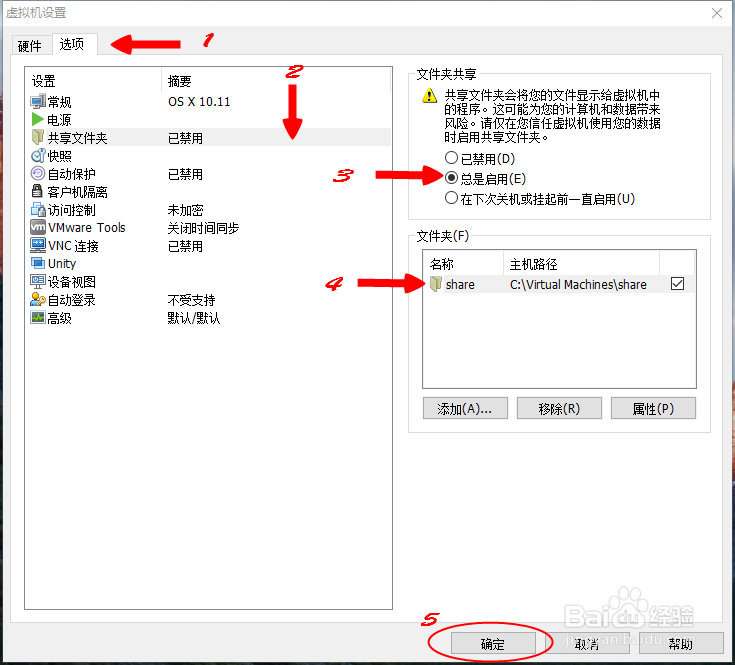

# macOS 虚拟机安装

## 0 前置

* CPU 需要支持 VT 技术, 即虚拟技术, 并在 BIOS 中开启
* VMware-workstation-full-12.5.0-4352439.exe
* 破解 VMware, 下载 "unlocker208", 关闭 VMware, 运行 win-install.cmd (win7 及以上需要右键以管理员身份运行)
    * 2.08 的 unlocker 里本身不包含 darwin.iso 补丁, 在进行打补丁的时候会自动从网络下载最新的 darwin.iso 并复制到 vmware 的安装目录, 请在此步保持网络畅通. 如果下载失败, 也可以手动下载
    * unlocker 的储存路径不能有中文字符, 否则会安装失败, 而且没有失败的提示
* 下载 macOS S 10.12.2 懒人版

## 1 新建虚拟机

* 将 macOS S 10.12.2(16C67).cdr 后缀改名为.iso
* 自定义(高级)
* 客户机系统 选 "Apple Mac OS X"
* 新建完成之后先不要启动虚拟机, 否则会出错, 用记事本打开虚拟机`.vmx`文件, 在 smc.present = "TRUE" 后添加"smc.version = 0"
* 重新启动 VMware
* 编辑虚拟机设置 --> 硬件 --> USB控制器, 兼容性改为2.0, 不然可能在 mac 里连接不到真机
* 启动虚拟机
    * 选中文
    * 实用工具 --> 磁盘工具
        * 选中新建的 VMWare 虚拟盘
        * 选择 "抹掉" 选项卡
        * 输入分区名称 mac
        * 点击完成后就回到原来的安装界面, 此时继续就可以安装了
    * 安装在刚抹掉的硬盘上

## 2 Tips

* 安装 VMware Tools, 使用的镜像就是破解 VMware 时下载的 darwin.iso
* 共享文件夹: 实现虚拟机与物理机的文件共享, 相互传文件用的挺多的.

* 如果觉得卡的话试下下面几步(以下几步在 10.12 里找的时候有点变动, 基本上找找还是能找到的)
    * 禁用各种华而不实的透明窗口和动画效果, OS X El Capitan 中大量采用透明菜单、窗口和标题栏, 这需要耗费处理器性能和内存渲染. 访问系统偏好设置, 进入"辅助功能", 然后勾选"减少透明度"即可
    * 将最小化窗口的动画从"神奇效果"改为"缩放效果"可以在窗口最小化时体验更快的运行速度. 进入系统偏好设置, 进入"Dock"功能, 并选择"缩放效果"即可.
    * 禁用通知中心中无用的组件和扩展, 通知中心有各种实用的小组件的确很炫酷, 不过却会损失很多性能. 对于旧款 Mac 来说, 通知中心开启太多组件会让重启和登陆过程变慢. 访问系统偏好设置, 进入"扩展"功能, 将不使用的组件勾掉即可
    * 如果是 mac os x10.10 yosemite 可安装 beamoff APP 提升在 vmware workstation 中的性能(OS X El Capitan 不装这个好像也不卡, 根据自己情况, 我这边是 10.10 之后的系统都没有装了), 可以设置为开机自动运行, 这个测试使用效果非常好, 网盘有提供下载, 见文章http://www.jianshu.com/p/c67c14b3110c
    * 如果想装一些应用, 10.12 禁用了"任何来源"的功能, 只需要终端里输入以下命令即可开启(需要管理员密码): `sudo spctl --master-disable`
* OS 升级更新到新版本可能不能启动, 这时要在网上寻找更新的 unlocker, 只需要重新安装 unlocker 即可启动
* 最好禁用自动更新: 在安装时断 vmware 的网, 第一次开机先禁用自动更新再联网
